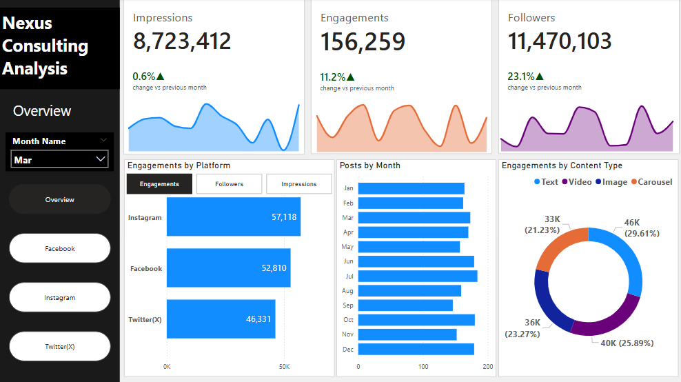

# Social Media Analysis for Nexus Consulting

## Introduction
**Prepared for:** Nexus Consulting
**Prepared by:** Daniel Odey
**Date:** February 25, 2025

## Executive Summary
This is report provides the performance of Nexus Consulting’s social media performance across Facebook, Instagram and Twitter(X). 

## Key Performance Indicators (KPI)
These are the KPIs for each social media platform

**Facebook**
 - Total Impressions: 35M
 - Total Engagements: 637K
 - Total Followers: 38M

**Instagram**
 - Total Impressions: 35M
 - Total Engagements: 637K
 - Total Followers: 38M

## Trends and Patterns
**Facebook**
We have noticed a consistent reduction in engagements, impressions and followers from June 2024. Also, peak performance period is June 2024. 

**Instagram**
There is an inconsistent pattern across all metrics. It appears that this decline in metrics performance happens roughly around a two-month period starting off at April 2020. 

**Twitter/X**
There was a sudden deep in metric performance in September then a consistent growth followed across all metrics. 

**Overall**
 - The social media performance was at its worse around August and September across all the social media platforms.
 - There is a balance of engagements across all content types.
   
## Dashboard

## Key Findings
 - The performance of the metrics across all platforms is majorly influenced by the number of posts made. This simply means that as posts reduces, metric performance tends to reduce too.
 - The days of the week with the most engagements across all the social platforms regardless of content type are Mondays, Tuesdays and Saturdays. NB: Instagram and Twitter(X) get more Saturday engagements than Facebook. This could be because people are typically free on weekends compared to weekdays. 
- For Facebook, the peak month was June, for Instagram the peak month was October and for twitter peak month is December.
 - An interesting observation about Twitter(X) is the drastic improvement in the metric performance from September and it kept improving even until December. 

## Recommendations
 - Seeing that the number of posts significantly influences metric performance, we recommend that the social media team increases their number of posts. Note that once the posts reduce, there is always a quick and significant decline in metric performance.
 - In order to get more social media engagements, posts should be made on peak days which are Monday, Tuesday and Saturday. For Instagram and Twitter(X), more focus should be made on Saturday.
 - The team should maintain their content-type spread as there seems to be a relatively balanced engagement for all content types across all social media platforms. 

## Conclusion
Nexus Consulting’s social media performance has shown notable trends across platforms, with fluctuations in engagement, impressions, and follower growth. While each platform has its peak months, overall performance is heavily influenced by posting frequency. Key engagement days—Monday, Tuesday, and Saturday—should be leveraged for maximum reach. By increasing post frequency and maintaining a balanced content strategy, Nexus Consulting can improve its social media impact and sustain audience engagement.

**Tools Used:** Microsoft Excel, Power BI

**Link to Live Dashboard:** [click here](https://app.powerbi.com/view?r=eyJrIjoiMjRlZTVmMTQtYTRiMS00OTRkLTg4MTgtZGVkMDUyMTY3ODE5IiwidCI6IjZjNzQ3Mzg1LTUyNTktNDcwMS05MTkzLTc5ZTkxNWNlYjA3ZSJ9)

